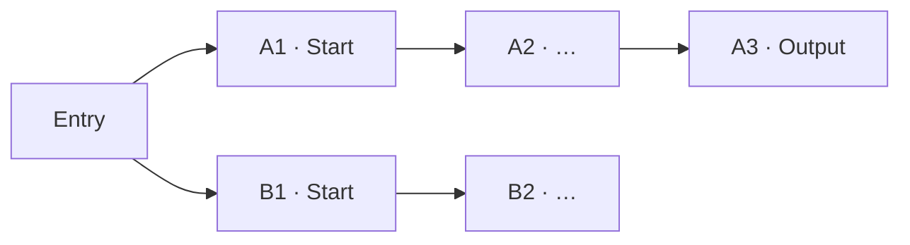
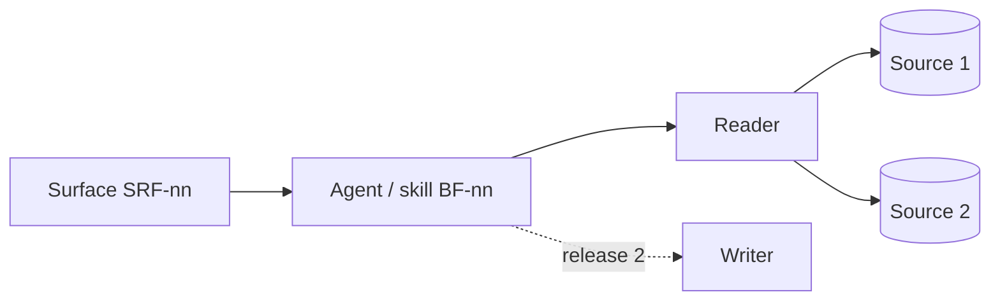

::: {.readme}
**In 30 seconds.** One document per scenario, three sections, one owner each. **3.1 Scenario brief** (PO) holds the decisions and why. **3.2 Functional overview** (UX) shows how the seller uses it. **3.3 Solution blueprint** (architecture lead) says what it is built on. Decisions live in 3.1 and are cited by ID in 3.2 and 3.3, never restated. Page 1 is the summary a steering reader needs; the rest is the reference the build team needs.
:::

# At a glance

_One paragraph: what the scenario does for whom, in which form, and what release 1 does not do._

## Scenario canvas

::: {.guide}
The five dimensions answered for this scenario, with catalogue IDs. Every other part of the dossier cites these IDs. Filled by the skill `draft-scenario-dossier` from the validated guide; confirmed by the three owners.
:::

| Dimension | Decision for this scenario | IDs |
|---|---|---|
| D1 · Seller job and journey | _Job in one sentence · persona · primary metric_ | _JM-nn · P1, P10, P11_ |
| D2 · Usage pattern | _Main pattern, second pattern if any · seller benefit_ | _UP-nn_ |
| D3 · Surface and build form | _Surface and level of control · format · build form and its justification_ | _SRF-nn · BF-nn · P2, P3, P4_ |
| D4 · Architecture and shared layers | _What it relies on · what it adds · what it does not use_ | _LY-nn · SC-nn · P5_ |
| D5 · Guardrails and safeguards | _Boundary in one line · rules applied_ | _GR-nn · SG-nn · P6, P7_ |

## Where we are

| Item | Status |
|---|---|
| Track | _Standard / Light, confirmed at the brief_ |
| Next gate | _Design review on … → ◆ Go build_ |
| Blockers before the review | _n, listed in the checklist_ |
| Changes proposed to the framework | _CH-nn, if any_ |
| Filed with the dossier | 1 · Intake form · 2 · Workshop guide · 4 · Checklist · mockup · intro call and workshop transcripts |

# 3.1 Scenario brief

_Owner: PO. One paragraph: the scenario in the seller's terms and the release-1 scope._

## Ask and positioning

| Item | Content |
|---|---|
| Ask as received | _Quote (intake)_ |
| Ask as reframed | _What we propose to do, in the seller's terms (workshop)_ |
| Positioning in the portfolio | _New scenario / extension of … / grouped with …; overlap verdict and date_ |
| Not promised | _What this scenario explicitly does not do, and where it belongs instead_ |

## Job, persona, activity · D1

| Item | Content |
|---|---|
| Job in one sentence | _…_ |
| Persona | _Primary persona; who else gives input or reads_ |
| Seller activity | _JM-nn · activity_ |
| Split or group | _What is grouped in this scenario; what is split out and to which scenario_ |

## Friction today and seller benefit · D1, D2

| Friction today | Benefit sought |
|---|---|
| _…_ | _…_ |
| _…_ | _…_ |
| _…_ | _…_ |

_What the domain values first (quality, speed, coverage). Baseline today, or "none"._

## Usage pattern and surface · D2, D3

| Item | Decision |
|---|---|
| Usage pattern | _UP-nn (main); UP-nn (second, when)_ |
| Surface and level of control | _SRF-nn, reached from …; level of control_ |
| Format | _Answer / card / notification / document / field update_ |

_Detail in 3.2._

## AI fit and build form · D3

| Phase of the work | AI | Deterministic | Seller |
|---|---|---|---|
| _Read the sources_ | _…_ | _…_ | _…_ |
| _Propose_ | _…_ | _…_ | _…_ |
| _Produce_ | _…_ | _…_ | _…_ |
| _Write_ | _…_ | _…_ | _…_ |

**Build form:** _BF-nn, preceded by … (release 0 if any)._

**Why this build form:** _two lines: its own trigger or identity (P2), and what prompts or skills cannot carry; the simpler forms tried or ruled out (P4)._

## Boundary · D5

The solution never:

- _… (decision ID)_
- _… (decision ID)_
- _… (decision ID)_

_Guardrails applied: GR-nn, GR-nn; GR-01 applies to …_

## Success · D1

| Level | Criterion | Baseline |
|---|---|---|
| Primary metric (P11) | _…_ | _… or none_ |
| This cycle | _…_ | |
| Release 1 | _…_ | |
| Next cycle | _…_ | |

_Candidates to measure: …_

## Phasing

| Release | When | Scope |
|---|---|---|
| 0 | _…_ | _…_ |
| 1 | _…_ | _…_ |
| 2 | _…_ | _…_ |

## Decision log

::: {.guide}
The single log of the scenario. Every decision has an ID with the scenario prefix; 3.2 and 3.3 cite it. Family-level decisions, if any, sit in the family's AI-fit statement and are referenced, not copied.
:::

| ID | Decision | Status, date | Owner |
|---|---|---|---|
| XXX-01 | _…_ | _Closed, DD Mon_ | _…_ |
| XXX-02 | _…_ | _Proposed_ | _…_ |
| XXX-03 | _…_ | _Open_ | _…_ |

# 3.2 Functional overview

_Owner: UX. One paragraph: the paths the seller can take and what each one ends with. Mission and decisions: see 3.1._

## Journey at a glance · D2

_Two lines: where each path ends; what is visible at entry but not in release 1._

## Key moments

| Step | What the solution does | Why it matters |
|---|---|---|
| 0 · Entry | _…_ | _…_ |
| A1 · … | _…_ | _… (decision ID)_ |
| A2 · … | _…_ | _…_ |
| B1 · … | _…_ | _…_ |

## Where it appears · D3

| Item | Content |
|---|---|
| Surface | _SRF-nn, reached from …_ |
| Level of control | _On demand / pushed / in context; who starts it_ |
| Format | _Chat text; files for long outputs; cards where supported_ |

| Capability needed | Available on the surface |
|---|---|
| _Structured cards_ | _Yes / No_ |
| _Progressive step display_ | _…_ |
| _File output opened from the chat_ | _…_ |
| _Push delivery_ | _…_ |

## UI principle of the usage pattern · D2

- _UP-nn principle, as the catalogue states it_
- _How this scenario applies it (one run one message; choices as follow-up chips; questions listed at the end…)_

## Confirmation, provenance and "I don't know" · D5

| Behaviour | How it shows in the screens |
|---|---|
| Provenance (SG-01) | _Tag on every value; tag set used_ |
| Discrepancy between sources | _…_ |
| What was not read or not used | _…_ |
| Confidential content | _…_ |
| Write refusal or confirmation (GR-01) | _…_ |
| Gap the solution cannot fill (GR-04) | _…_ |

## Information shown to the seller

| Output or section | What the solution produces | Main sources |
|---|---|---|
| _…_ | _…_ | _…_ |

## Functional scope by release

| Release | Paths and functions |
|---|---|
| 0 | _…_ |
| 1 | _…_ |
| 2 | _…_ |

## Example prompts and expected outputs

| Seller says | Expected output |
|---|---|
| _"…"_ | _…_ |
| _"…"_ | _…_ |

## Mockup

_Link, version, date; illustrative content stated as such._

# 3.3 Solution blueprint

_Owner: architecture lead. One paragraph: the build form, what it sits on, what it reads and what it writes. Context and decisions: see 3.1._

## High-level architecture · D3, D4

_What the diagram shows and what it leaves out._

## Components

| Component | Role | Nature | Shared or specific |
|---|---|---|---|
| _Instructions_ | _…_ | _Natural language, versioned_ | _…_ |
| _Skill …_ | _…_ | _LLM_ | _…_ |
| _Reader / renderer / writer_ | _…_ | _Deterministic_ | _…_ |
| _Knowledge_ | _…_ | _Grounded sources_ | _…_ |

## AI / deterministic split applied · D3

- _What the LLM carries_
- _What deterministic parts own (boundaries: reading, rendering, writing)_
- _What the orchestration decides, and never decides_

## Shared layers and signals · D4

| Layer or component | Used how | Read or created | Note |
|---|---|---|---|
| LY-01 Data connectivity | _Sources declared_ | Read | _Data estimate sits here_ |
| LY-02 Intelligence | _…_ | _…_ | _Two consumers?_ |
| LY-04 Guardrails and provenance | _SC-02, SC-03_ | Reused | _…_ |
| LY-05 Adoption and monitoring | _SC-08_ | Reports | _Metric per decision ID_ |

_Layers not used and why. Anything new is justified against what exists._

## Data sources and integrations · D4

| Source | What it holds | Access in release 1 | Status |
|---|---|---|---|
| _…_ | _…_ | _Read / not read / as files_ | _Known / to confirm_ |

## Triggers and orchestration

- _Who or what starts a run_
- _One read per run; outputs reuse it_
- _Scheduled or event triggers, if any_

## Guardrails, safeguards, access and retention · D5

| ID | Rule | Applied as |
|---|---|---|
| P6, GR-01 | Confirm before any write | _…_ |
| SG-01, SC-03, P7 | Provenance on every value | _…_ |
| GR-02 | Same access rights as the user | _…_ |
| GR-03, P10 | Agreed decision scope | _…_ |
| GR-04 | Say "I don't know" | _…_ |
| GR-05 | Personal data | _…_ |
| GR-06 | Sensitive content | _…_ |
| SG-03, SC-07 | Evaluation before and after release | _…_ |
| SG-04, SC-04 | Log of every AI write | _…_ |
| — | Retention | _…_ |

## Legal, privacy and certification inputs

| Topic | Input for GRCC and the AI risk assessment |
|---|---|
| Personal data | _…_ |
| Confidentiality | _…_ |
| Write path | _…_ |
| Licensing and run cost | _…_ |
| Environment | _Stack ID, developer environment_ |

## Open technical questions

- _Question · decides XXX-nn_
- _…_
