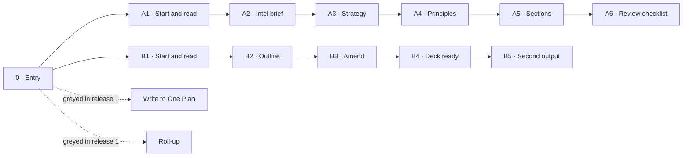
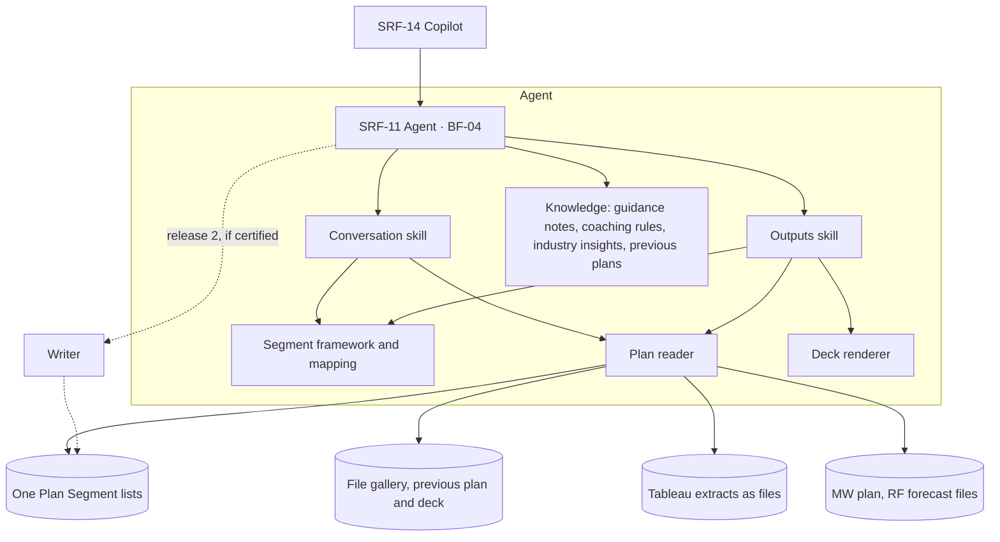

::: {.readme}
**In 30 seconds.** AI support to the global account plans held in One Plan Segment, for the Global Segment SAEs (CSP segment first, about 12 plans). One assistant helps an SAE build a better strategic account plan and use it all year, around the app and read-only in release 1. Status: draft for design review; not ready yet, six blockers in the checklist. Built from the requirements session of 30 Sep 2026 and its consolidated guide, the data deep dive of 2 Oct, the playback of 6 Oct and the One Plan family AI-fit statement (AD-01 to AD-15).
:::

# At a glance

One assistant, reached from Copilot, helps the Global Segment SAE build a better strategic account plan (intel brief, strategy challenged against the guidance notes, sections drafted per One Plan page) and use it all year (one current account story, outputs per audience, a deck, a roll-up across the segment's plans). Release 0 is shared prompts now; release 1 in November is read-only content mode; the full build with coaching and a possible write-back is next cycle. Nothing is written to One Plan Segment in release 1.

## Scenario canvas

| Dimension | Decision for this scenario | IDs |
|---|---|---|
| D1 · Seller job and journey | Build a better account plan and use it all year · Persona: Global Segment SAE, account owner of one strategic account · Primary metric: plans passing review without a coherence challenge (proposed, SEG-16) | JM-06 · P1, P10, P11 |
| D2 · Usage pattern | The SAE produces a plan or a deck from a draft (main); asks questions on the account story in-year · Benefit: sources read in one pass, strategy challenged before review, one story for every audience | UP-08 · UP-04 |
| D3 · Surface and build form | Release 0: prompts in Copilot · Releases 1 and 2: a dedicated agent with its own identity, reached from Copilot; outputs as documents · Build form justified by its own identity and knowledge plus a deterministic reader and renderer | SRF-11 via SRF-14; SRF-09 (release 0) · BF-01 then BF-04 · P2, P3, P4 |
| D4 · Architecture and shared layers | Reads the app and files; Tableau only as extracts shared as files (SEG-17); reuses the One Plan family core; industry insights computed once per segment · LY-03 not used: no CRM write | LY-01, LY-02, LY-04 (SC-02, SC-03), LY-05 (SC-08) · P5 |
| D5 · Guardrails and safeguards | Read-only in release 1; confirmation before any reuse; provenance on every value; declared values never derived; confidential commentary excluded | GR-01 (release 2), GR-02 to GR-06 · SG-01, SG-03; SG-04 with the release-2 writer · P6, P7 |

## Where we are

| Item | Status |
|---|---|
| Track | Standard: new data sources, personal data on coverage pages, a write-back option, cross-account reading for the roll-up |
| Next gate | Design review, date to set → ◆ Go build |
| Blockers before the review | 6, listed in the checklist: SEG-15, SEG-12, SEG-11, cross-account access, owners of 3.2 and 3.3, evaluation set (SG-03) |
| Changes proposed to the framework | CH-01 Sales Chat cannot host an agent with its own instructions · CH-02 SG-01 tag set extended · CH-03 deterministic parts and P2 |
| Filed with the dossier | 1 · Intake form · 2 · Workshop guide · 4 · Checklist · mockup v0.1 (6 Oct) · transcripts of 29 Sep and 30 Sep |

# 3.1 Scenario brief

Owner: PO. One assistant helps the Global Segment SAEs build a better strategic account plan and use it all year, around One Plan Segment and read-only in release 1.

## Ask and positioning

| Item | Content |
|---|---|
| Ask as received | "Can we add AI to One Plan", open-ended (intake, 22 Sep) |
| Ask as reframed | Build a better plan: intel gathered, strategy stated by the SAE and challenged, sections drafted. Use it all year: one current account story, outputs per audience, a deck, a roll-up across plans (workshop, 30 Sep) |
| Positioning in the portfolio | Segment variant of the One Plan family: shared core with the End User assistant, Segment framework and mapping on top (AD-15, SEG-11). Around the app, not inside it (AD-01, SEG-03). Overlap verdict: extend the One Plan family; design authority to confirm |
| Not promised | Data consolidation of the MW build plan, the forecast and the pipeline (SEG-06). Executive briefs, which belong to Executive Intelligence (SEG-07) |

## Job, persona, activity · D1

| Item | Content |
|---|---|
| Job in one sentence | Help the global account team build a better strategic account plan, and use it all year as one coherent, current account story, without rebuilding it per audience |
| Persona | Global Segment SAE, one strategic account full time, with the global programme manager. Input from regional KAMs; leadership reads the plans and the roll-up |
| Seller activity | JM-06 · I manage and plan my accounts |
| Split or group | Grouped: build, use and roll-up are one scenario on one plan. Split out: executive briefs and bios to Executive Intelligence; competitor signals to competitor intelligence; meeting prep and debrief to the post-meeting experience |

## Friction today and seller benefit · D1, D2

| Friction today | Benefit sought |
|---|---|
| Facts collected across regions and disconnected sources, the most time-consuming work | Sources read in one pass, every value sourced, discrepancies shown |
| Strategy built without coaching; incoherent chains found in review | Strategy challenged before review against the guidance notes |
| Every leadership request rebuilt by hand; versions contradict each other | Outputs per audience from one account story |
| Nobody reads the ~12 plans as a set | Roll-up across the segment's plans |
| Workaround: screenshots of the app pasted into Copilot, then re-entry | Prompts now; drafted sections; write-back later if certified |

The domain values quality first, speed second. No baseline exists today.

## Usage pattern and surface · D2, D3

| Item | Decision |
|---|---|
| Usage pattern | UP-08 I produce documents and strategies (main): SAE-initiated, multi-turn guided work on path A, on-demand generation on path B and the roll-up. UP-04 I ask questions (in-year) |
| Surface and level of control | SRF-11 Dedicated agent, reached through SRF-14 Copilot / Cowork; SRF-03 Sales Chat only as skills and MCP tools (BF-03), SEG-12 open. On demand, started by the SAE |
| Format | Text messages plus generated files; no Adaptive Cards, no progressive display |

Detail in 3.2.

## AI fit and build form · D3

| Phase of the work | AI | Deterministic | SAE |
|---|---|---|---|
| Read the plan and the sources | Synthesis, discrepancy detection | Plan reader, source tags | Shares extra files |
| Intel brief | Facts, recommendations, questions | Industry insights computed once per segment | Answers the questions |
| Strategy | Reflects, challenges, asks for what is missing | Coaching rules from the guidance notes | States the strategy, decides |
| Sections and outputs | Drafts from the stated principles | Page and slide mapping | Confirms before any reuse |
| Deck | Outline and text | Renderer on the template | Amends, sends |
| Write to One Plan | None | Writer, release 2 if certified | Proofreads first |

**Build form:** BF-04 Copilot Studio agent, new experience (AD-05), preceded by BF-01 shared prompts (release 0).

**Why this build form:** the agent earns its existence (P2) through its own identity and knowledge across the planning cycle (Segment framework, guidance notes, previous plans), plus two deterministic parts prompts cannot carry: the plan reader and the deck renderer. P4 applied: prompts are tried first and the agent inherits the ones that work; BF-03 skills on Sales Chat stay the fallback if the scope shrinks (SEG-12). Writing speed is not the value: the SAEs hold one account each and write little; the value is the quality of the strategy and the consolidation (29 Sep).

## Boundary · D5

The assistant never:

- writes a strategic statement the SAE has not made (SEG-04)
- sets share of wallet, ranks competitors, colours a domain or sets relationship sentiment (SEG-05)
- presents a figure without its source
- resolves a discrepancy between sources (SEG-06)
- shares executive commentary with an audience not entitled to it
- writes to One Plan Segment or any tool without the SAE's proofread (AD-02, SEG-03)

Guardrails applied: GR-03 agreed decision scope, GR-04 "I don't know", GR-06 sensitive data under access rules, GR-02 the user's access rights; GR-01 applies to the release-2 write-back.

## Success · D1

| Level | Criterion | Baseline |
|---|---|---|
| Primary metric (P11), proposed | Plans that pass the executive review without a coherence challenge (SEG-16) | None today |
| This cycle | SAEs use the shared prompts instead of screenshots; one roll-up for the 10 Dec committee | None |
| Release 1 | Account story with every line sourced; deck produced from the plan; leadership requests answered from the story | None |
| Next cycle | FY28 plans built with the assistant; SAEs judge them better than the previous ones | None |

Candidates to measure: time to a reviewed plan, time to prepare a deck, leadership requests and time to answer, versions in circulation per account.

## Phasing

| Release | When | Scope |
|---|---|---|
| 0 · Prompts | Now, plans filled until 10 Dec | Shared prompts: structure, challenge, draft from notes |
| 1 · Content mode | November, read-only | In-year updates, persona outputs, roll-up, PowerPoint export; coherence check and intel refresh if they do not hold up the launch |
| 2 · Full build | Next cycle (FY28 plans) | Intel brief and strategy coaching in full; write-back if certified |

## Decision log

Family decisions AD-01 to AD-15 sit in the One Plan family AI-fit statement. Segment decisions:

| ID | Decision | Status, date | Owner |
|---|---|---|---|
| SEG-01 | Segment before End User this cycle | Closed, 29 Sep | Fernanda, Tara |
| SEG-02 | Three releases: prompts, read-only content mode, full build | Proposed, to play back | Fernanda |
| SEG-03 | Around the app, read-only in release 1 | Closed | Tara |
| SEG-04 | The SAE decides; the assistant proposes and challenges | Closed, 30 Sep | Tara, Dana |
| SEG-05 | Declared values stay declared | Closed | Tara, Dana |
| SEG-06 | Discrepancies shown, not resolved; no consolidation promised | Closed, 30 Sep | Tara |
| SEG-07 | Executive briefs through Executive Intelligence | Closed, 30 Sep | Fernanda, Tara |
| SEG-08 | No leadership self-service at launch | Closed, 30 Sep | Tara, Dana |
| SEG-09 | PowerPoint generation in scope | Closed, 30 Sep | Tara, Dana |
| SEG-10 | Roll-up across the segment's plans in scope | Closed, 29 Sep | Tara |
| SEG-11 | Shared core with End User; thin Segment layer | Proposed | Victor |
| SEG-12 | Surface: M365 Copilot or Sales Chat | Open | Xyra |
| SEG-13 | Smartsheet playbook as a source | Open | Dana |
| SEG-14 | Write-back to One Plan Segment, recommended if feasible | Open | Tara, Fernanda, Xyra |
| SEG-15 | Release 1 scope: the mockup MVP shows path A (build with coaching), which SEG-02 places in release 2 | Open | Fernanda, Tara |
| SEG-16 | Primary metric: plans passing review without a coherence challenge | Proposed | Tara |
| SEG-17 | No direct read from Tableau, in any release; Tableau data enters only as extracts shared as files | Closed, 6 Oct | Product team |

Open items with owners and dates are in the guide wrap-up and in the checklist.

# 3.2 Functional overview

Owner: UX, to assign. The SAE picks one of two paths from the entry screen: build the plan with coaching, or build a deck from the plan. Every value shown carries its source; nothing is written to One Plan. Mission and decisions: see 3.1.

## Journey at a glance · D2

Path A ends with sections to paste and a review checklist; path B ends with a rendered deck the SAE sends. The two greyed cards are visible at entry so the SAE sees what release 1 does not do.

## Key moments

| Step | What the assistant does | Why it matters |
|---|---|---|
| 0 · Entry | Offers two paths; shows the write and the roll-up as greyed cards | Sets expectations: nothing promised that release 1 does not do |
| A1 · Start and read | Reads last year's plan and status, the deck, the file gallery, a Tableau extract if shared, the data pages; says what it did not read | The SAE knows the base before any output |
| A1b · What to provide | Lists inputs it has, could use, needs from the SAE, and will not use | The SAE shares a bundle once; confidential content stays out |
| A2 · Intel brief | Last year targeted vs delivered, what changed, discrepancies, recommendations tagged, questions | Intel first, strategy second (AD-13) |
| A3 · Strategy | Reflects the SAE's words, challenges against the guidance notes and the intel, asks for what is missing | The SAE decides (SEG-04) |
| A4 · Principles | Recaps the strategy in the SAE's words only | The spine of the plan, confirmed before drafting |
| A5 · Sections | Drafts text per One Plan Segment page; refuses to write in the app | Ready to paste; declared values left to the SAE (SEG-05) |
| A6 · Review checklist | Raises insights the plan does not use, as a choice; runs the checklist | Fewer coherence challenges in review |
| B1 · Start and read | Reads the plan, deck, extract, gallery; shows discrepancies with both numbers | Discrepancies shown, not resolved (SEG-06) |
| B2 · Outline | Proposes slides with a source each; drops declared values for this audience unless asked | The SAE shapes the deck before it is rendered |
| B3 · Amend | Changes only what was asked | Iteration without starting over |
| B4 · Deck ready | Renders on the template; speaker notes carry sources and discrepancies; does not send | The SAE owns what leaves |
| B5 · Second output | Reuses the same read for another audience | One read, several outputs |

## Where it appears · D3

| Item | Content |
|---|---|
| Surface | SRF-11 Dedicated agent, reached through SRF-14 Copilot / Cowork; SRF-03 Sales Chat only if the scope shrinks to a skill (SEG-12) |
| Level of control | On demand, started by the SAE; no push in release 1 |
| Format | Chat text for the conversation; generated files for long outputs: intel brief (HTML), sections (DOCX), deck (PPTX) |

| Capability needed | M365 Copilot / Sales Chat |
|---|---|
| Structured cards | No: text and file cards only |
| Progressive step display | No: one complete message per run |
| File output opened from the chat | Yes |
| Push delivery | Not used in release 1 |
| Voice | Not used |

## UI principle of the usage pattern · D2

- UP-08: a document the SAE owns, an editable draft, never final. The SAE asks; the assistant reads, then proposes.
- One run, one complete message; long content goes to a file.
- Recommendations are tagged as such and never pre-filled as decisions.
- Questions to the SAE are listed explicitly at the end of a message.
- Choices are offered as follow-up chips: start the strategy, draft the sections, amend, build it.

## Confirmation, provenance and "I don't know" · D5

| Behaviour | How it shows in the screens |
|---|---|
| Provenance (SG-01) | A tag on every line: your words, your decision, recommendation, or the source (One Plan page, file, Tableau extract, public, industry insights) |
| Discrepancy | Both values shown, the reference named (Tableau over typed figures), flagged in the speaker notes |
| What was not read | Stated in the read message: MW plan, RF forecast, playbook when not shared or not cleared |
| Confidential content | Stated as excluded: "2 executive comments tagged confidential" |
| Write refusal (GR-01) | "Not in this release. Writing to One Plan Segment is a separate decision, pending certification of the write path." |
| Gap the assistant cannot fill (GR-04) | Named as a gap, not drafted: e.g. a missing EMEA KAM on the coverage page |

## Information shown to the SAE

| Plan section | What the assistant produces | Main sources |
|---|---|---|
| Account overview | Narrative of customer, footprint, scale, changes | MW file, file gallery, public sources, previous plan |
| SE footprint and performance | Presence per location; orders mix by region and year | Global Footprint page, Tableau extracts |
| Customer priorities → SE initiatives | Drafted from the stated strategy, coached, checked | Conversation, customer strategy decks, guidance notes |
| Growth plan 1Y / 5Y | Defend / grow / acquire from the stated bets | Conversation, Strategic Ambition file, industry insights |
| Services, roadblocks and asks | Drafted from stated initiatives; completeness check | Services Strategy page, conversation |
| Competitive landscape | Declared positions only | Share of Wallet page |
| Relationship and coverage | Stakeholder map and coverage gaps | Relationship Suite Map, Account Coverage |
| Key success indicators | Proposed from the stated initiatives | Conversation, previous deck |

## Functional scope by release

| Release | Paths and functions |
|---|---|
| 0 · Prompts | Structure a section, challenge a strategy, draft from notes, over pasted content |
| 1 · Content mode | Path B (deck and persona outputs), in-year updates, roll-up; coherence check and intel refresh if they fit. Path A pending SEG-15 |
| 2 · Full build | Path A in full; write-back if certified (SEG-14) |

## Example prompts and expected outputs

| SAE says | Expected output |
|---|---|
| "Build my FY27 plan for Amazon, starting from last year." | Read summary, then the list of inputs it has, could use and needs |
| "What would you do on APAC?" | Two options from the intel, tagged as recommendations; no pick |
| "Just write it in One Plan." | The write refusal; the text per page offered to paste |
| "Build a deck for the Amazon review with the EMEA VP on Thursday, EMEA focus, 6 slides." | Read summary with discrepancies, then an outline with a source per slide |

## Mockup

One Plan Segment assistant mockup, v0.1, 6 Oct 2026, illustrative content (Amazon FY27). Filed with the dossier.

# 3.3 Solution blueprint

Owner: architecture lead, to assign. One agent in Copilot Studio new experience, on the One Plan family core, with a thin Segment layer, reading four sources and writing nothing in release 1. Context and decisions: see 3.1.

## High-level architecture · D3, D4

The plan reader is the only path to the sources in release 1; the dashed writer appears only if the write path is certified (SEG-14). The MW plan and RF forecast files are read the same way when the SAE shares them.

## Components

| Component | Role | Nature | Shared or Segment |
|---|---|---|---|
| Agent instructions | Who the assistant is, the boundary, which skill and knowledge to use | Natural language, versioned | Shared, with a Segment section |
| Conversation skill | Intel brief, strategy conversation with coaching, drafting, coherence check | LLM-heavy, most turns | Shared |
| Outputs skill | Account story, persona and regional views, in-year updates, roll-up | LLM over read content | Shared logic, Segment queries |
| Framework and mapping | Segment framework; block-to-page and block-to-slide mapping; guidance notes as writing rules | Configuration and knowledge | Segment |
| Plan reader | Reads One Plan pages, file gallery, uploaded decks, Tableau extracts shared as files; no direct read from Tableau; attaches the source tag | Deterministic, internal to skills | Segment |
| Deck renderer | Fills the growth-strategy template from confirmed content; provenance in the speaker notes | Deterministic, not LLM-callable | Segment |
| Provenance and audit rules | Source tags, coherence chain, confirmation before reuse | Rules applied by every skill | Shared |
| Knowledge | Guidance notes, coaching rules, industry insights per segment, previous plans | Grounded sources | Shared pattern, Segment content |
| Writer to One Plan Segment | Confirmed sections into the SharePoint lists | Deterministic | Release 2, if certified (SEG-14) |

## AI / deterministic split applied · D3

- One conversation skill carries most turns; no skill per journey step.
- Deterministic parts own the boundaries: reading the app, rendering the deck, later writing to the app.
- The orchestration decides which skill answers, when to read a source, when to raise a coaching question or a discrepancy.
- It never decides a strategic statement, a judgement value or a write.

## Shared layers and signals · D4

| Layer or component | Used how | Read or created | Note |
|---|---|---|---|
| One Plan family core | Intel, coaching, drafting, provenance, audit | Reused by End User and Segment agents | Gated on skill reuse across agents in the new experience (SEG-11) |
| LY-01 Data connectivity | One Plan lists, file gallery, previous plan, Tableau extracts as files | Read; sources declared | Data estimate sits in LY-01 |
| LY-02 Intelligence | Industry insights per segment | Read; produced once by the industry owner | Existence for CSP to confirm; qualifies for SC-05 once End User consumes them too |
| LY-02 Intelligence | Coherence check, roll-up | Created, computed once | Cross-account reading needs an access decision (GR-02) |
| LY-04 Guardrails and provenance | SC-02 confirmation pattern; SC-03 provenance store | Reused | Tag set to align with SG-01 and competitor intelligence (CH-02) |
| LY-05 Adoption and monitoring | SC-08 adoption and consumption dashboard | Reports primary metric and consumption | Metric per SEG-16 |
| Outside the layers | Account story | Created | Second consumer committed through Executive Intelligence's backlog only |

LY-03 CRM interaction is not used: nothing is written to the CRM.

## Data sources and integrations · D4

| Source | What it holds | Access in release 1 | Status |
|---|---|---|---|
| One Plan Segment, SharePoint lists | 14 pages: footprint, performance, objectives, share of wallet, growth plan, services, coverage, relationships, audit trail | Read through the SharePoint back end | Column names to receive from Xyra |
| One Plan file gallery | Customer strategy decks, 5-year forecast file, uploaded decks | Read as documents | Known |
| Previous plan and deck | Last year's plan and growth-strategy deck | Read; slide titles as keys | Known |
| Tableau | YTD orders, regional and product split | No direct read: extracts shared as files by the SAE or the programme manager; the reference where the app holds the same measure | No connector (SEG-17) |
| MW build plan, RF forecast | Shared Excel, bottom-up by region | Read as files; shown, not reconciled | Disconnected from bFO |
| bFO | Opportunities and pipeline | Not read | Proposed for release 2 |
| Account playbook, Smartsheet | Relationship plan, footprint, heat map, actions | Read if access is cleared | To study with Dana (SEG-13) |
| M365 meetings and emails | Customer interactions | Not read | Consent to confirm |

## Triggers and orchestration

- Every run is started by the SAE in the chat; no scheduled or event trigger in release 1.
- One read per run; outputs reuse it (path B5).
- Intel refresh in-year, if included, is proposed to the SAE to accept, not pushed.

## Guardrails, safeguards, access and retention · D5

| ID | Rule | Applied as |
|---|---|---|
| P6, GR-01 | Read-only in release 1; confirmation before any write | No write path configured; the release-2 writer writes only confirmed sections |
| SC-02 | Confirmation before reuse | Every section, deck or update confirmed by the SAE before it leaves the conversation |
| SG-01, SC-03, P7 | Provenance on every value | Tag set at ingestion, carried to the deck's speaker notes |
| GR-03, P10 | Declared values and decision scope | Share of wallet, competitor positions, heat map, sentiment, priority colours never derived; no strategic statement the SAE has not made |
| GR-04 | Say "I don't know" | Sources not read and gaps are stated; a gap is never filled with a plausible value |
| GR-06 | Sensitive and confidential content | Executive commentary tagged at ingestion, excluded from any output not addressed to the SAE; marking method open |
| GR-02 | Same access rights as the user | SAEs and global programme managers only at launch; roll-up access across accounts to decide |
| GR-05 | Personal data | Names and roles on coverage pages; risk assessment scope to confirm |
| SG-03, SC-07 | Evaluation before and after release | Not planned yet; to define before release 1 |
| SG-04, SC-04 | Log of every AI write | With the release-2 writer |
| — | Retention | Outputs are files in the SAE's conversation; no parallel store (AD-14) |

## Legal, privacy and certification inputs

| Topic | Input for GRCC and the AI risk assessment |
|---|---|
| Personal data | Names and roles on the Coverage and Relationship pages; risk assessment versus full certification to confirm |
| Confidentiality | Strategic plan content; deep dive on anonymised content or under controlled access |
| Write path | Separate certification scope, release 2 |
| Licensing and run cost | Copilot licence coverage of the Segment SAEs; Copilot Studio run cost |
| Environment | Stack ID and developer environment under the ASF programme, pending approval |

## Open technical questions

- Write path to the SharePoint lists from Copilot Studio without premium licensing, and its certification · decides SEG-14
- Skill reuse across agents in the new experience · decides SEG-11
- Read path to the lists: column names, structure, file gallery as a readable library
- Reading across accounts for the roll-up: who may read which plans, enforced how
- Tableau extracts: who produces them, how often, and which measures are the reference (SEG-17)
- Smartsheet playbook: access, structure, readability (SEG-13)
- Marking of confidential commentary at the source
- Deck renderer: keeping slide titles stable so next year's deck can be read back
